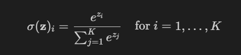

# Info
Applictation of Logistic Regression to predict digits in MNIST dataset
## Imports & installs
- sudo apt install python3-tk
- pip3 install numpy
## MNIST set
Handwritten digits used for image processing training and testing

# Logic flow
## 1. Import data
- Import data and print N,D,K for validation of shapes

## 2. Define softmax
- Define softmax function $\sigma(\mathbf{z})_i$ applied to element of vector $\mathbf{z}$ with dimentions (N,D)
- K is the number of classes in vector $\mathbf{z}$

## 3. Define log-likelihood for softmax
The log likelihood is calculated using the formula: 

$$
\mathcal{L} = \sum_{n=1}^{N} \sum_{k=1}^{K} y_k^{(n)} \cdot \ln(\hat{y}_k^{(n)})
$$

where $ \hat{y}_k^{(n)}$ is the predicted probability of class k for the n-th observation, $y_k^{(n)}$ is the actual outcome. One hot encoding is used meaning y is 1 if the observation belongs to class k , and 0 otherwise.

## 4. Define Multinomial Logistic regression model
### 4.1 Do forward pass
- Add column of 1's to X for bias term
- Do forward pass to calculate initial $\hat{y}$

### 4.2 Train by using iterative gradient decent on minibatch
- The derivative of the log likelihood with respect to the weights vector is:

$$
\frac{\partial \mathcal{L}}{\partial \mathbf{W}_k} = (\hat{y}_k^{(n)} - y_k^{(n)}) \cdot \mathbf{x}^{(n)}
$$
- Update weights at each iteration of the gradient descent algorithm according to the rule:

$$
\mathbf{W} = \mathbf{W} - \alpha \frac{\partial \mathcal{L}}{\partial \mathbf{W}}
$$

### 4.3 Estimate $\hat{y}$ of test using trained weigts
- Do forward pass using test data

### 4.4 Compute accuracy
Calculate and ouput model accuracy

